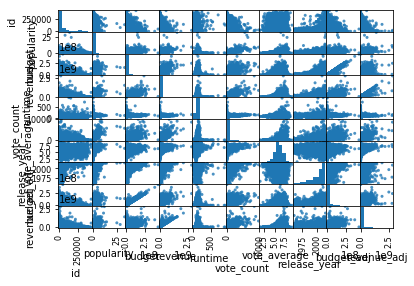
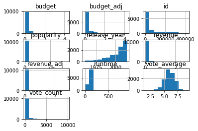
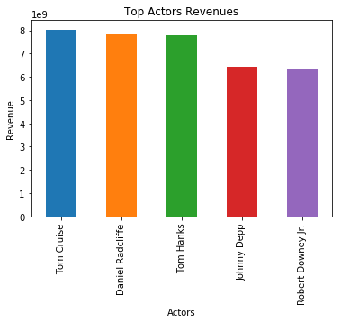
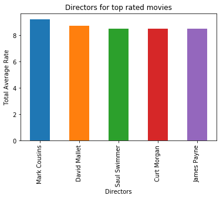
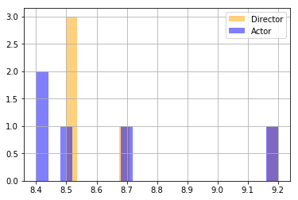
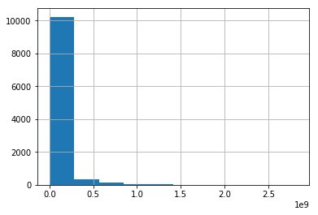
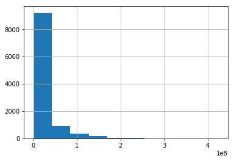
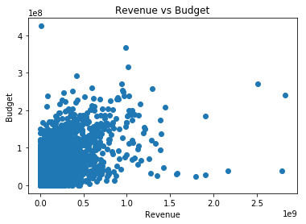
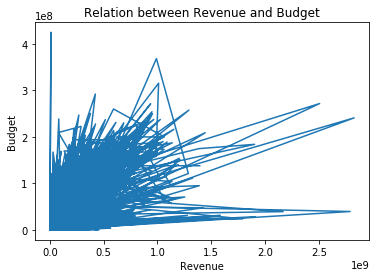

# Project: Investigate a Dataset - TDP Movies

## Table of Contents
<ul>
<li><a href="#intro">Introduction</a></li>
<li><a href="#wrangling">Data Wrangling</a></li>
<li><a href="#eda">Exploratory Data Analysis</a></li>
<li><a href="#conclusions">Conclusions</a></li>
</ul>

<a id='intro'></a>
## Introduction

#### Dataset Description 

This data set contains information about 10,000 movies collected from The Movie Database (TMDb), including user ratings and revenue.

Certain columns, like ‘cast’ and ‘genres’, contain multiple values separated by pipe (|) characters.
There are some odd characters in the ‘cast’ column. Don’t worry about cleaning them. You can leave them as is.
The final two columns ending with “_adj” show the budget and revenue of the associated movie in terms of 2010 dollars, accounting for inflation over time.


#### Columns:
   Imdb_id         -  -               original_title
   cast                -  -              popularity
   director          -  -             production_companies
   release_year  -  -            revenue
   budget_adj     -  -           revenue_adj


### Question(s) for Analysis

##### Which acrtor achieve revenue in their movies
##### who the director has top successfull movies
##### production companies revenue vs budget (loss or gain)


#### import statements for all of the packages we need to run the project


```python
# import statements for all of the packages

import pandas as pd
import numpy as np
import matplotlib.pyplot as plt
import seaborn as snb
%matplotlib inline
```


```python
# Upgrade pandas to use dataframe.explode() function. 
!pip install --upgrade pandas==0.25.0
```

    Collecting pandas==0.25.0
    [?25l  Downloading https://files.pythonhosted.org/packages/1d/9a/7eb9952f4b4d73fbd75ad1d5d6112f407e695957444cb695cbb3cdab918a/pandas-0.25.0-cp36-cp36m-manylinux1_x86_64.whl (10.5MB)
        100% |████████████████████████████████| 10.5MB 3.2MB/s eta 0:00:01   33% |██████████▉                     | 3.5MB 28.7MB/s eta 0:00:01    47% |███████████████                 | 4.9MB 28.9MB/s eta 0:00:01    60% |███████████████████▎            | 6.3MB 29.4MB/s eta 0:00:01    73% |███████████████████████▌        | 7.7MB 30.0MB/s eta 0:00:01    99% |███████████████████████████████▊| 10.4MB 28.3MB/s eta 0:00:01
    [?25hCollecting numpy>=1.13.3 (from pandas==0.25.0)
    [?25l  Downloading https://files.pythonhosted.org/packages/45/b2/6c7545bb7a38754d63048c7696804a0d947328125d81bf12beaa692c3ae3/numpy-1.19.5-cp36-cp36m-manylinux1_x86_64.whl (13.4MB)
        100% |████████████████████████████████| 13.4MB 2.7MB/s eta 0:00:01   24% |███████▊                        | 3.2MB 27.3MB/s eta 0:00:01    62% |████████████████████            | 8.3MB 26.5MB/s eta 0:00:01
    [?25hRequirement already satisfied, skipping upgrade: python-dateutil>=2.6.1 in /opt/conda/lib/python3.6/site-packages (from pandas==0.25.0) (2.6.1)
    Requirement already satisfied, skipping upgrade: pytz>=2017.2 in /opt/conda/lib/python3.6/site-packages (from pandas==0.25.0) (2017.3)
    Requirement already satisfied, skipping upgrade: six>=1.5 in /opt/conda/lib/python3.6/site-packages (from python-dateutil>=2.6.1->pandas==0.25.0) (1.11.0)
    tensorflow 1.3.0 requires tensorflow-tensorboard<0.2.0,>=0.1.0, which is not installed.
    Installing collected packages: numpy, pandas
      Found existing installation: numpy 1.12.1
        Uninstalling numpy-1.12.1:
          Successfully uninstalled numpy-1.12.1
      Found existing installation: pandas 0.23.3
        Uninstalling pandas-0.23.3:
          Successfully uninstalled pandas-0.23.3
    Successfully installed numpy-1.19.5 pandas-0.25.0


<a id='wrangling'></a>
## Data Wrangling


### General Properties


Load data from  tmdb-movies.csv file


```python
df= pd.read_csv('Database_TMDb_movie_data/tmdb-movies.csv')
df.info()
```

    <class 'pandas.core.frame.DataFrame'>
    RangeIndex: 10866 entries, 0 to 10865
    Data columns (total 21 columns):
    id                      10866 non-null int64
    imdb_id                 10856 non-null object
    popularity              10866 non-null float64
    budget                  10866 non-null int64
    revenue                 10866 non-null int64
    original_title          10866 non-null object
    cast                    10790 non-null object
    homepage                2936 non-null object
    director                10822 non-null object
    tagline                 8042 non-null object
    keywords                9373 non-null object
    overview                10862 non-null object
    runtime                 10866 non-null int64
    genres                  10843 non-null object
    production_companies    9836 non-null object
    release_date            10866 non-null object
    vote_count              10866 non-null int64
    vote_average            10866 non-null float64
    release_year            10866 non-null int64
    budget_adj              10866 non-null float64
    revenue_adj             10866 non-null float64
    dtypes: float64(4), int64(6), object(11)
    memory usage: 1.7+ MB


Check the statistics for the data frame


```python
df.describe()
```


<div>
<style scoped>
    .dataframe tbody tr th:only-of-type {
        vertical-align: middle;
    }

    .dataframe tbody tr th {
        vertical-align: top;
    }

    .dataframe thead th {
        text-align: right;
    }
</style>
<table border="1" class="dataframe">
  <thead>
    <tr style="text-align: right;">
      <th></th>
      <th>id</th>
      <th>popularity</th>
      <th>budget</th>
      <th>revenue</th>
      <th>runtime</th>
      <th>vote_count</th>
      <th>vote_average</th>
      <th>release_year</th>
      <th>budget_adj</th>
      <th>revenue_adj</th>
    </tr>
  </thead>
  <tbody>
    <tr>
      <th>count</th>
      <td>10866.000000</td>
      <td>10866.000000</td>
      <td>1.086600e+04</td>
      <td>1.086600e+04</td>
      <td>10866.000000</td>
      <td>10866.000000</td>
      <td>10866.000000</td>
      <td>10866.000000</td>
      <td>1.086600e+04</td>
      <td>1.086600e+04</td>
    </tr>
    <tr>
      <th>mean</th>
      <td>66064.177434</td>
      <td>0.646441</td>
      <td>1.462570e+07</td>
      <td>3.982332e+07</td>
      <td>102.070863</td>
      <td>217.389748</td>
      <td>5.974922</td>
      <td>2001.322658</td>
      <td>1.755104e+07</td>
      <td>5.136436e+07</td>
    </tr>
    <tr>
      <th>std</th>
      <td>92130.136561</td>
      <td>1.000185</td>
      <td>3.091321e+07</td>
      <td>1.170035e+08</td>
      <td>31.381405</td>
      <td>575.619058</td>
      <td>0.935142</td>
      <td>12.812941</td>
      <td>3.430616e+07</td>
      <td>1.446325e+08</td>
    </tr>
    <tr>
      <th>min</th>
      <td>5.000000</td>
      <td>0.000065</td>
      <td>0.000000e+00</td>
      <td>0.000000e+00</td>
      <td>0.000000</td>
      <td>10.000000</td>
      <td>1.500000</td>
      <td>1960.000000</td>
      <td>0.000000e+00</td>
      <td>0.000000e+00</td>
    </tr>
    <tr>
      <th>25%</th>
      <td>10596.250000</td>
      <td>0.207583</td>
      <td>0.000000e+00</td>
      <td>0.000000e+00</td>
      <td>90.000000</td>
      <td>17.000000</td>
      <td>5.400000</td>
      <td>1995.000000</td>
      <td>0.000000e+00</td>
      <td>0.000000e+00</td>
    </tr>
    <tr>
      <th>50%</th>
      <td>20669.000000</td>
      <td>0.383856</td>
      <td>0.000000e+00</td>
      <td>0.000000e+00</td>
      <td>99.000000</td>
      <td>38.000000</td>
      <td>6.000000</td>
      <td>2006.000000</td>
      <td>0.000000e+00</td>
      <td>0.000000e+00</td>
    </tr>
    <tr>
      <th>75%</th>
      <td>75610.000000</td>
      <td>0.713817</td>
      <td>1.500000e+07</td>
      <td>2.400000e+07</td>
      <td>111.000000</td>
      <td>145.750000</td>
      <td>6.600000</td>
      <td>2011.000000</td>
      <td>2.085325e+07</td>
      <td>3.369710e+07</td>
    </tr>
    <tr>
      <th>max</th>
      <td>417859.000000</td>
      <td>32.985763</td>
      <td>4.250000e+08</td>
      <td>2.781506e+09</td>
      <td>900.000000</td>
      <td>9767.000000</td>
      <td>9.200000</td>
      <td>2015.000000</td>
      <td>4.250000e+08</td>
      <td>2.827124e+09</td>
    </tr>
  </tbody>
</table>
</div>


Check the number of columns and rows for the dataframe


```python
# Check the number of columns and rows for the dataframe
df.shape
```


    (10866, 21)


Get the number of NA/Null values for each feature


```python
# Get the number of NA/Null values for each feature
df.isnull().sum()
```


    id                         0
    imdb_id                   10
    popularity                 0
    budget                     0
    revenue                    0
    original_title             0
    cast                      76
    homepage                7930
    director                  44
    tagline                 2824
    keywords                1493
    overview                   4
    runtime                    0
    genres                    23
    production_companies    1030
    release_date               0
    vote_count                 0
    vote_average               0
    release_year               0
    budget_adj                 0
    revenue_adj                0
    dtype: int64


### Data Cleaning

#### Which data to be droped

For the questions about cast and director, it will be necessary to drop the rows has NA values.
Production_companies will droped in the question number 3.

#### which data to be filled
The production companies missing data will be filled with "Other companies" value

####Columns to be droped
The columns home page, tagline and keywords NA values will be dropped because it is not inculded in the calculations
 


```python
''' Drop the cast and directors NA values from 
the dataframe to calculate the average revenue and top rated movies
'''
df.dropna(subset=['cast','director'], how='any',inplace=True)
```


```python
df.drop(['homepage','tagline','keywords'],axis=1, inplace=True)
```

Check features after drop the NA


```python
# Check features after drop the NA
df.info()
```

    <class 'pandas.core.frame.DataFrame'>
    Int64Index: 10752 entries, 0 to 10865
    Data columns (total 18 columns):
    id                      10752 non-null int64
    imdb_id                 10746 non-null object
    popularity              10752 non-null float64
    budget                  10752 non-null int64
    revenue                 10752 non-null int64
    original_title          10752 non-null object
    cast                    10752 non-null object
    director                10752 non-null object
    overview                10749 non-null object
    runtime                 10752 non-null int64
    genres                  10732 non-null object
    production_companies    9780 non-null object
    release_date            10752 non-null object
    vote_count              10752 non-null int64
    vote_average            10752 non-null float64
    release_year            10752 non-null int64
    budget_adj              10752 non-null float64
    revenue_adj             10752 non-null float64
    dtypes: float64(4), int64(6), object(8)
    memory usage: 1.9+ MB


```python
df.drop_duplicates()
```


<div>
<style scoped>
    .dataframe tbody tr th:only-of-type {
        vertical-align: middle;
    }

    .dataframe tbody tr th {
        vertical-align: top;
    }

    .dataframe thead th {
        text-align: right;
    }
</style>
<table border="1" class="dataframe">
  <thead>
    <tr style="text-align: right;">
      <th></th>
      <th>id</th>
      <th>imdb_id</th>
      <th>popularity</th>
      <th>budget</th>
      <th>revenue</th>
      <th>original_title</th>
      <th>cast</th>
      <th>director</th>
      <th>overview</th>
      <th>runtime</th>
      <th>genres</th>
      <th>production_companies</th>
      <th>release_date</th>
      <th>vote_count</th>
      <th>vote_average</th>
      <th>release_year</th>
      <th>budget_adj</th>
      <th>revenue_adj</th>
      <th>MainActor</th>
    </tr>
  </thead>
  <tbody>
    <tr>
      <th>0</th>
      <td>135397</td>
      <td>tt0369610</td>
      <td>32.985763</td>
      <td>150000000</td>
      <td>1513528810</td>
      <td>Jurassic World</td>
      <td>Chris Pratt|Bryce Dallas Howard|Irrfan Khan|Vi...</td>
      <td>Colin Trevorrow</td>
      <td>Twenty-two years after the events of Jurassic ...</td>
      <td>124</td>
      <td>Action|Adventure|Science Fiction|Thriller</td>
      <td>Universal Studios|Amblin Entertainment|Legenda...</td>
      <td>6/9/15</td>
      <td>5562</td>
      <td>6.5</td>
      <td>2015</td>
      <td>1.379999e+08</td>
      <td>1.392446e+09</td>
      <td>Chris Pratt</td>
    </tr>
    <tr>
      <th>1</th>
      <td>76341</td>
      <td>tt1392190</td>
      <td>28.419936</td>
      <td>150000000</td>
      <td>378436354</td>
      <td>Mad Max: Fury Road</td>
      <td>Tom Hardy|Charlize Theron|Hugh Keays-Byrne|Nic...</td>
      <td>George Miller</td>
      <td>An apocalyptic story set in the furthest reach...</td>
      <td>120</td>
      <td>Action|Adventure|Science Fiction|Thriller</td>
      <td>Village Roadshow Pictures|Kennedy Miller Produ...</td>
      <td>5/13/15</td>
      <td>6185</td>
      <td>7.1</td>
      <td>2015</td>
      <td>1.379999e+08</td>
      <td>3.481613e+08</td>
      <td>Tom Hardy</td>
    </tr>
    <tr>
      <th>2</th>
      <td>262500</td>
      <td>tt2908446</td>
      <td>13.112507</td>
      <td>110000000</td>
      <td>295238201</td>
      <td>Insurgent</td>
      <td>Shailene Woodley|Theo James|Kate Winslet|Ansel...</td>
      <td>Robert Schwentke</td>
      <td>Beatrice Prior must confront her inner demons ...</td>
      <td>119</td>
      <td>Adventure|Science Fiction|Thriller</td>
      <td>Summit Entertainment|Mandeville Films|Red Wago...</td>
      <td>3/18/15</td>
      <td>2480</td>
      <td>6.3</td>
      <td>2015</td>
      <td>1.012000e+08</td>
      <td>2.716190e+08</td>
      <td>Shailene Woodley</td>
    </tr>
    <tr>
      <th>3</th>
      <td>140607</td>
      <td>tt2488496</td>
      <td>11.173104</td>
      <td>200000000</td>
      <td>2068178225</td>
      <td>Star Wars: The Force Awakens</td>
      <td>Harrison Ford|Mark Hamill|Carrie Fisher|Adam D...</td>
      <td>J.J. Abrams</td>
      <td>Thirty years after defeating the Galactic Empi...</td>
      <td>136</td>
      <td>Action|Adventure|Science Fiction|Fantasy</td>
      <td>Lucasfilm|Truenorth Productions|Bad Robot</td>
      <td>12/15/15</td>
      <td>5292</td>
      <td>7.5</td>
      <td>2015</td>
      <td>1.839999e+08</td>
      <td>1.902723e+09</td>
      <td>Harrison Ford</td>
    </tr>
    <tr>
      <th>4</th>
      <td>168259</td>
      <td>tt2820852</td>
      <td>9.335014</td>
      <td>190000000</td>
      <td>1506249360</td>
      <td>Furious 7</td>
      <td>Vin Diesel|Paul Walker|Jason Statham|Michelle ...</td>
      <td>James Wan</td>
      <td>Deckard Shaw seeks revenge against Dominic Tor...</td>
      <td>137</td>
      <td>Action|Crime|Thriller</td>
      <td>Universal Pictures|Original Film|Media Rights ...</td>
      <td>4/1/15</td>
      <td>2947</td>
      <td>7.3</td>
      <td>2015</td>
      <td>1.747999e+08</td>
      <td>1.385749e+09</td>
      <td>Vin Diesel</td>
    </tr>
    <tr>
      <th>5</th>
      <td>281957</td>
      <td>tt1663202</td>
      <td>9.110700</td>
      <td>135000000</td>
      <td>532950503</td>
      <td>The Revenant</td>
      <td>Leonardo DiCaprio|Tom Hardy|Will Poulter|Domhn...</td>
      <td>Alejandro González Iñárritu</td>
      <td>In the 1820s, a frontiersman, Hugh Glass, sets...</td>
      <td>156</td>
      <td>Western|Drama|Adventure|Thriller</td>
      <td>Regency Enterprises|Appian Way|CatchPlay|Anony...</td>
      <td>12/25/15</td>
      <td>3929</td>
      <td>7.2</td>
      <td>2015</td>
      <td>1.241999e+08</td>
      <td>4.903142e+08</td>
      <td>Leonardo DiCaprio</td>
    </tr>
    <tr>
      <th>6</th>
      <td>87101</td>
      <td>tt1340138</td>
      <td>8.654359</td>
      <td>155000000</td>
      <td>440603537</td>
      <td>Terminator Genisys</td>
      <td>Arnold Schwarzenegger|Jason Clarke|Emilia Clar...</td>
      <td>Alan Taylor</td>
      <td>The year is 2029. John Connor, leader of the r...</td>
      <td>125</td>
      <td>Science Fiction|Action|Thriller|Adventure</td>
      <td>Paramount Pictures|Skydance Productions</td>
      <td>6/23/15</td>
      <td>2598</td>
      <td>5.8</td>
      <td>2015</td>
      <td>1.425999e+08</td>
      <td>4.053551e+08</td>
      <td>Arnold Schwarzenegger</td>
    </tr>
    <tr>
      <th>7</th>
      <td>286217</td>
      <td>tt3659388</td>
      <td>7.667400</td>
      <td>108000000</td>
      <td>595380321</td>
      <td>The Martian</td>
      <td>Matt Damon|Jessica Chastain|Kristen Wiig|Jeff ...</td>
      <td>Ridley Scott</td>
      <td>During a manned mission to Mars, Astronaut Mar...</td>
      <td>141</td>
      <td>Drama|Adventure|Science Fiction</td>
      <td>Twentieth Century Fox Film Corporation|Scott F...</td>
      <td>9/30/15</td>
      <td>4572</td>
      <td>7.6</td>
      <td>2015</td>
      <td>9.935996e+07</td>
      <td>5.477497e+08</td>
      <td>Matt Damon</td>
    </tr>
    <tr>
      <th>8</th>
      <td>211672</td>
      <td>tt2293640</td>
      <td>7.404165</td>
      <td>74000000</td>
      <td>1156730962</td>
      <td>Minions</td>
      <td>Sandra Bullock|Jon Hamm|Michael Keaton|Allison...</td>
      <td>Kyle Balda|Pierre Coffin</td>
      <td>Minions Stuart, Kevin and Bob are recruited by...</td>
      <td>91</td>
      <td>Family|Animation|Adventure|Comedy</td>
      <td>Universal Pictures|Illumination Entertainment</td>
      <td>6/17/15</td>
      <td>2893</td>
      <td>6.5</td>
      <td>2015</td>
      <td>6.807997e+07</td>
      <td>1.064192e+09</td>
      <td>Sandra Bullock</td>
    </tr>
    <tr>
      <th>9</th>
      <td>150540</td>
      <td>tt2096673</td>
      <td>6.326804</td>
      <td>175000000</td>
      <td>853708609</td>
      <td>Inside Out</td>
      <td>Amy Poehler|Phyllis Smith|Richard Kind|Bill Ha...</td>
      <td>Pete Docter</td>
      <td>Growing up can be a bumpy road, and it's no ex...</td>
      <td>94</td>
      <td>Comedy|Animation|Family</td>
      <td>Walt Disney Pictures|Pixar Animation Studios|W...</td>
      <td>6/9/15</td>
      <td>3935</td>
      <td>8.0</td>
      <td>2015</td>
      <td>1.609999e+08</td>
      <td>7.854116e+08</td>
      <td>Amy Poehler</td>
    </tr>
    <tr>
      <th>10</th>
      <td>206647</td>
      <td>tt2379713</td>
      <td>6.200282</td>
      <td>245000000</td>
      <td>880674609</td>
      <td>Spectre</td>
      <td>Daniel Craig|Christoph Waltz|Léa Seydoux|Ralp...</td>
      <td>Sam Mendes</td>
      <td>A cryptic message from Bond’s past sends him...</td>
      <td>148</td>
      <td>Action|Adventure|Crime</td>
      <td>Columbia Pictures|Danjaq|B24</td>
      <td>10/26/15</td>
      <td>3254</td>
      <td>6.2</td>
      <td>2015</td>
      <td>2.253999e+08</td>
      <td>8.102203e+08</td>
      <td>Daniel Craig</td>
    </tr>
    <tr>
      <th>11</th>
      <td>76757</td>
      <td>tt1617661</td>
      <td>6.189369</td>
      <td>176000003</td>
      <td>183987723</td>
      <td>Jupiter Ascending</td>
      <td>Mila Kunis|Channing Tatum|Sean Bean|Eddie Redm...</td>
      <td>Lana Wachowski|Lilly Wachowski</td>
      <td>In a universe where human genetic material is ...</td>
      <td>124</td>
      <td>Science Fiction|Fantasy|Action|Adventure</td>
      <td>Village Roadshow Pictures|Dune Entertainment|A...</td>
      <td>2/4/15</td>
      <td>1937</td>
      <td>5.2</td>
      <td>2015</td>
      <td>1.619199e+08</td>
      <td>1.692686e+08</td>
      <td>Mila Kunis</td>
    </tr>
    <tr>
      <th>12</th>
      <td>264660</td>
      <td>tt0470752</td>
      <td>6.118847</td>
      <td>15000000</td>
      <td>36869414</td>
      <td>Ex Machina</td>
      <td>Domhnall Gleeson|Alicia Vikander|Oscar Isaac|S...</td>
      <td>Alex Garland</td>
      <td>Caleb, a 26 year old coder at the world's larg...</td>
      <td>108</td>
      <td>Drama|Science Fiction</td>
      <td>DNA Films|Universal Pictures International (UP...</td>
      <td>1/21/15</td>
      <td>2854</td>
      <td>7.6</td>
      <td>2015</td>
      <td>1.379999e+07</td>
      <td>3.391985e+07</td>
      <td>Domhnall Gleeson</td>
    </tr>
    <tr>
      <th>13</th>
      <td>257344</td>
      <td>tt2120120</td>
      <td>5.984995</td>
      <td>88000000</td>
      <td>243637091</td>
      <td>Pixels</td>
      <td>Adam Sandler|Michelle Monaghan|Peter Dinklage|...</td>
      <td>Chris Columbus</td>
      <td>Video game experts are recruited by the milita...</td>
      <td>105</td>
      <td>Action|Comedy|Science Fiction</td>
      <td>Columbia Pictures|Happy Madison Productions</td>
      <td>7/16/15</td>
      <td>1575</td>
      <td>5.8</td>
      <td>2015</td>
      <td>8.095996e+07</td>
      <td>2.241460e+08</td>
      <td>Adam Sandler</td>
    </tr>
    <tr>
      <th>14</th>
      <td>99861</td>
      <td>tt2395427</td>
      <td>5.944927</td>
      <td>280000000</td>
      <td>1405035767</td>
      <td>Avengers: Age of Ultron</td>
      <td>Robert Downey Jr.|Chris Hemsworth|Mark Ruffalo...</td>
      <td>Joss Whedon</td>
      <td>When Tony Stark tries to jumpstart a dormant p...</td>
      <td>141</td>
      <td>Action|Adventure|Science Fiction</td>
      <td>Marvel Studios|Prime Focus|Revolution Sun Studios</td>
      <td>4/22/15</td>
      <td>4304</td>
      <td>7.4</td>
      <td>2015</td>
      <td>2.575999e+08</td>
      <td>1.292632e+09</td>
      <td>Robert Downey Jr.</td>
    </tr>
    <tr>
      <th>15</th>
      <td>273248</td>
      <td>tt3460252</td>
      <td>5.898400</td>
      <td>44000000</td>
      <td>155760117</td>
      <td>The Hateful Eight</td>
      <td>Samuel L. Jackson|Kurt Russell|Jennifer Jason ...</td>
      <td>Quentin Tarantino</td>
      <td>Bounty hunters seek shelter from a raging bliz...</td>
      <td>167</td>
      <td>Crime|Drama|Mystery|Western</td>
      <td>Double Feature Films|The Weinstein Company|Fil...</td>
      <td>12/25/15</td>
      <td>2389</td>
      <td>7.4</td>
      <td>2015</td>
      <td>4.047998e+07</td>
      <td>1.432992e+08</td>
      <td>Samuel L. Jackson</td>
    </tr>
    <tr>
      <th>16</th>
      <td>260346</td>
      <td>tt2446042</td>
      <td>5.749758</td>
      <td>48000000</td>
      <td>325771424</td>
      <td>Taken 3</td>
      <td>Liam Neeson|Forest Whitaker|Maggie Grace|Famke...</td>
      <td>Olivier Megaton</td>
      <td>Ex-government operative Bryan Mills finds his ...</td>
      <td>109</td>
      <td>Crime|Action|Thriller</td>
      <td>Twentieth Century Fox Film Corporation|M6 Film...</td>
      <td>1/1/15</td>
      <td>1578</td>
      <td>6.1</td>
      <td>2015</td>
      <td>4.415998e+07</td>
      <td>2.997096e+08</td>
      <td>Liam Neeson</td>
    </tr>
    <tr>
      <th>17</th>
      <td>102899</td>
      <td>tt0478970</td>
      <td>5.573184</td>
      <td>130000000</td>
      <td>518602163</td>
      <td>Ant-Man</td>
      <td>Paul Rudd|Michael Douglas|Evangeline Lilly|Cor...</td>
      <td>Peyton Reed</td>
      <td>Armed with the astonishing ability to shrink i...</td>
      <td>115</td>
      <td>Science Fiction|Action|Adventure</td>
      <td>Marvel Studios</td>
      <td>7/14/15</td>
      <td>3779</td>
      <td>7.0</td>
      <td>2015</td>
      <td>1.195999e+08</td>
      <td>4.771138e+08</td>
      <td>Paul Rudd</td>
    </tr>
    <tr>
      <th>18</th>
      <td>150689</td>
      <td>tt1661199</td>
      <td>5.556818</td>
      <td>95000000</td>
      <td>542351353</td>
      <td>Cinderella</td>
      <td>Lily James|Cate Blanchett|Richard Madden|Helen...</td>
      <td>Kenneth Branagh</td>
      <td>When her father unexpectedly passes away, youn...</td>
      <td>112</td>
      <td>Romance|Fantasy|Family|Drama</td>
      <td>Walt Disney Pictures|Genre Films|Beagle Pug Fi...</td>
      <td>3/12/15</td>
      <td>1495</td>
      <td>6.8</td>
      <td>2015</td>
      <td>8.739996e+07</td>
      <td>4.989630e+08</td>
      <td>Lily James</td>
    </tr>
    <tr>
      <th>19</th>
      <td>131634</td>
      <td>tt1951266</td>
      <td>5.476958</td>
      <td>160000000</td>
      <td>650523427</td>
      <td>The Hunger Games: Mockingjay - Part 2</td>
      <td>Jennifer Lawrence|Josh Hutcherson|Liam Hemswor...</td>
      <td>Francis Lawrence</td>
      <td>With the nation of Panem in a full scale war, ...</td>
      <td>136</td>
      <td>War|Adventure|Science Fiction</td>
      <td>Studio Babelsberg|StudioCanal|Lionsgate|Walt D...</td>
      <td>11/18/15</td>
      <td>2380</td>
      <td>6.5</td>
      <td>2015</td>
      <td>1.471999e+08</td>
      <td>5.984813e+08</td>
      <td>Jennifer Lawrence</td>
    </tr>
    <tr>
      <th>20</th>
      <td>158852</td>
      <td>tt1964418</td>
      <td>5.462138</td>
      <td>190000000</td>
      <td>209035668</td>
      <td>Tomorrowland</td>
      <td>Britt Robertson|George Clooney|Raffey Cassidy|...</td>
      <td>Brad Bird</td>
      <td>Bound by a shared destiny, a bright, optimisti...</td>
      <td>130</td>
      <td>Action|Family|Science Fiction|Adventure|Mystery</td>
      <td>Walt Disney Pictures|Babieka|A113</td>
      <td>5/19/15</td>
      <td>1899</td>
      <td>6.2</td>
      <td>2015</td>
      <td>1.747999e+08</td>
      <td>1.923127e+08</td>
      <td>Britt Robertson</td>
    </tr>
    <tr>
      <th>21</th>
      <td>307081</td>
      <td>tt1798684</td>
      <td>5.337064</td>
      <td>30000000</td>
      <td>91709827</td>
      <td>Southpaw</td>
      <td>Jake Gyllenhaal|Rachel McAdams|Forest Whitaker...</td>
      <td>Antoine Fuqua</td>
      <td>Billy "The Great" Hope, the reigning junior mi...</td>
      <td>123</td>
      <td>Action|Drama</td>
      <td>Escape Artists|Riche-Ludwig Productions</td>
      <td>6/15/15</td>
      <td>1386</td>
      <td>7.3</td>
      <td>2015</td>
      <td>2.759999e+07</td>
      <td>8.437300e+07</td>
      <td>Jake Gyllenhaal</td>
    </tr>
    <tr>
      <th>22</th>
      <td>254128</td>
      <td>tt2126355</td>
      <td>4.907832</td>
      <td>110000000</td>
      <td>470490832</td>
      <td>San Andreas</td>
      <td>Dwayne Johnson|Alexandra Daddario|Carla Gugino...</td>
      <td>Brad Peyton</td>
      <td>In the aftermath of a massive earthquake in Ca...</td>
      <td>114</td>
      <td>Action|Drama|Thriller</td>
      <td>New Line Cinema|Village Roadshow Pictures|Warn...</td>
      <td>5/27/15</td>
      <td>2060</td>
      <td>6.1</td>
      <td>2015</td>
      <td>1.012000e+08</td>
      <td>4.328514e+08</td>
      <td>Dwayne Johnson</td>
    </tr>
    <tr>
      <th>23</th>
      <td>216015</td>
      <td>tt2322441</td>
      <td>4.710402</td>
      <td>40000000</td>
      <td>569651467</td>
      <td>Fifty Shades of Grey</td>
      <td>Dakota Johnson|Jamie Dornan|Jennifer Ehle|Eloi...</td>
      <td>Sam Taylor-Johnson</td>
      <td>When college senior Anastasia Steele steps in ...</td>
      <td>125</td>
      <td>Drama|Romance</td>
      <td>Focus Features|Trigger Street Productions|Mich...</td>
      <td>2/11/15</td>
      <td>1865</td>
      <td>5.3</td>
      <td>2015</td>
      <td>3.679998e+07</td>
      <td>5.240791e+08</td>
      <td>Dakota Johnson</td>
    </tr>
    <tr>
      <th>24</th>
      <td>318846</td>
      <td>tt1596363</td>
      <td>4.648046</td>
      <td>28000000</td>
      <td>133346506</td>
      <td>The Big Short</td>
      <td>Christian Bale|Steve Carell|Ryan Gosling|Brad ...</td>
      <td>Adam McKay</td>
      <td>The men who made millions from a global econom...</td>
      <td>130</td>
      <td>Comedy|Drama</td>
      <td>Paramount Pictures|Plan B Entertainment|Regenc...</td>
      <td>12/11/15</td>
      <td>1545</td>
      <td>7.3</td>
      <td>2015</td>
      <td>2.575999e+07</td>
      <td>1.226787e+08</td>
      <td>Christian Bale</td>
    </tr>
    <tr>
      <th>25</th>
      <td>177677</td>
      <td>tt2381249</td>
      <td>4.566713</td>
      <td>150000000</td>
      <td>682330139</td>
      <td>Mission: Impossible - Rogue Nation</td>
      <td>Tom Cruise|Jeremy Renner|Simon Pegg|Rebecca Fe...</td>
      <td>Christopher McQuarrie</td>
      <td>Ethan and team take on their most impossible m...</td>
      <td>131</td>
      <td>Action</td>
      <td>Paramount Pictures|Skydance Productions|China ...</td>
      <td>7/23/15</td>
      <td>2349</td>
      <td>7.1</td>
      <td>2015</td>
      <td>1.379999e+08</td>
      <td>6.277435e+08</td>
      <td>Tom Cruise</td>
    </tr>
    <tr>
      <th>26</th>
      <td>214756</td>
      <td>tt2637276</td>
      <td>4.564549</td>
      <td>68000000</td>
      <td>215863606</td>
      <td>Ted 2</td>
      <td>Mark Wahlberg|Seth MacFarlane|Amanda Seyfried|...</td>
      <td>Seth MacFarlane</td>
      <td>Newlywed couple Ted and Tami-Lynn want to have...</td>
      <td>115</td>
      <td>Comedy</td>
      <td>Universal Pictures|Media Rights Capital|Fuzzy ...</td>
      <td>6/25/15</td>
      <td>1666</td>
      <td>6.3</td>
      <td>2015</td>
      <td>6.255997e+07</td>
      <td>1.985944e+08</td>
      <td>Mark Wahlberg</td>
    </tr>
    <tr>
      <th>27</th>
      <td>207703</td>
      <td>tt2802144</td>
      <td>4.503789</td>
      <td>81000000</td>
      <td>403802136</td>
      <td>Kingsman: The Secret Service</td>
      <td>Taron Egerton|Colin Firth|Samuel L. Jackson|Mi...</td>
      <td>Matthew Vaughn</td>
      <td>The story of a super-secret spy organization t...</td>
      <td>130</td>
      <td>Crime|Comedy|Action|Adventure</td>
      <td>Twentieth Century Fox Film Corporation|Marv Fi...</td>
      <td>1/24/15</td>
      <td>3833</td>
      <td>7.6</td>
      <td>2015</td>
      <td>7.451997e+07</td>
      <td>3.714978e+08</td>
      <td>Taron Egerton</td>
    </tr>
    <tr>
      <th>28</th>
      <td>314365</td>
      <td>tt1895587</td>
      <td>4.062293</td>
      <td>20000000</td>
      <td>88346473</td>
      <td>Spotlight</td>
      <td>Mark Ruffalo|Michael Keaton|Rachel McAdams|Lie...</td>
      <td>Tom McCarthy</td>
      <td>The true story of how The Boston Globe uncover...</td>
      <td>128</td>
      <td>Drama|Thriller|History</td>
      <td>Participant Media|Open Road Films|Anonymous Co...</td>
      <td>11/6/15</td>
      <td>1559</td>
      <td>7.8</td>
      <td>2015</td>
      <td>1.839999e+07</td>
      <td>8.127872e+07</td>
      <td>Mark Ruffalo</td>
    </tr>
    <tr>
      <th>29</th>
      <td>294254</td>
      <td>tt4046784</td>
      <td>3.968891</td>
      <td>61000000</td>
      <td>311256926</td>
      <td>Maze Runner: The Scorch Trials</td>
      <td>Dylan O'Brien|Kaya Scodelario|Thomas Brodie-Sa...</td>
      <td>Wes Ball</td>
      <td>Thomas and his fellow Gladers face their great...</td>
      <td>132</td>
      <td>Action|Science Fiction|Thriller</td>
      <td>Gotham Group|Temple Hill Entertainment|TSG Ent...</td>
      <td>9/9/15</td>
      <td>1849</td>
      <td>6.4</td>
      <td>2015</td>
      <td>5.611998e+07</td>
      <td>2.863562e+08</td>
      <td>Dylan O'Brien</td>
    </tr>
    <tr>
      <th>...</th>
      <td>...</td>
      <td>...</td>
      <td>...</td>
      <td>...</td>
      <td>...</td>
      <td>...</td>
      <td>...</td>
      <td>...</td>
      <td>...</td>
      <td>...</td>
      <td>...</td>
      <td>...</td>
      <td>...</td>
      <td>...</td>
      <td>...</td>
      <td>...</td>
      <td>...</td>
      <td>...</td>
      <td>...</td>
    </tr>
    <tr>
      <th>10836</th>
      <td>38720</td>
      <td>tt0061170</td>
      <td>0.239435</td>
      <td>0</td>
      <td>0</td>
      <td>Walk Don't Run</td>
      <td>Cary Grant|Samantha Eggar|Jim Hutton|John Stan...</td>
      <td>Charles Walters</td>
      <td>British industrialist Sir William Rutland - "B...</td>
      <td>114</td>
      <td>Comedy|Romance</td>
      <td>Columbia Pictures Corporation</td>
      <td>1/1/66</td>
      <td>11</td>
      <td>5.8</td>
      <td>1966</td>
      <td>0.000000e+00</td>
      <td>0.000000e+00</td>
      <td>Cary Grant</td>
    </tr>
    <tr>
      <th>10837</th>
      <td>19728</td>
      <td>tt0060177</td>
      <td>0.291704</td>
      <td>0</td>
      <td>0</td>
      <td>The Blue Max</td>
      <td>George Peppard|James Mason|Ursula Andress|Jere...</td>
      <td>John Guillermin</td>
      <td>A young pilot in the German air force of 1918,...</td>
      <td>156</td>
      <td>War|Action|Adventure|Drama</td>
      <td>Twentieth Century Fox Film Corporation</td>
      <td>6/21/66</td>
      <td>12</td>
      <td>5.5</td>
      <td>1966</td>
      <td>0.000000e+00</td>
      <td>0.000000e+00</td>
      <td>George Peppard</td>
    </tr>
    <tr>
      <th>10838</th>
      <td>22383</td>
      <td>tt0060862</td>
      <td>0.151845</td>
      <td>0</td>
      <td>0</td>
      <td>The Professionals</td>
      <td>Burt Lancaster|Lee Marvin|Robert Ryan|Woody St...</td>
      <td>Richard Brooks</td>
      <td>The Professionals is a 1966 American Western f...</td>
      <td>117</td>
      <td>Action|Adventure|Western</td>
      <td>Columbia Pictures</td>
      <td>11/1/66</td>
      <td>21</td>
      <td>6.0</td>
      <td>1966</td>
      <td>0.000000e+00</td>
      <td>0.000000e+00</td>
      <td>Burt Lancaster</td>
    </tr>
    <tr>
      <th>10839</th>
      <td>13353</td>
      <td>tt0060550</td>
      <td>0.276133</td>
      <td>0</td>
      <td>0</td>
      <td>It's the Great Pumpkin, Charlie Brown</td>
      <td>Christopher Shea|Sally Dryer|Kathy Steinberg|A...</td>
      <td>Bill Melendez</td>
      <td>This classic "Peanuts" tale focuses on the thu...</td>
      <td>25</td>
      <td>Family|Animation</td>
      <td>Warner Bros. Home Video</td>
      <td>10/27/66</td>
      <td>49</td>
      <td>7.2</td>
      <td>1966</td>
      <td>0.000000e+00</td>
      <td>0.000000e+00</td>
      <td>Christopher Shea</td>
    </tr>
    <tr>
      <th>10840</th>
      <td>34388</td>
      <td>tt0060437</td>
      <td>0.102530</td>
      <td>0</td>
      <td>0</td>
      <td>Funeral in Berlin</td>
      <td>Michael Caine|Paul Hubschmid|Oskar Homolka|Eva...</td>
      <td>Guy Hamilton</td>
      <td>Colonel Stok, a Soviet intelligence officer re...</td>
      <td>102</td>
      <td>Thriller</td>
      <td>Lowndes Productions Limited</td>
      <td>12/22/66</td>
      <td>13</td>
      <td>5.7</td>
      <td>1966</td>
      <td>0.000000e+00</td>
      <td>0.000000e+00</td>
      <td>Michael Caine</td>
    </tr>
    <tr>
      <th>10841</th>
      <td>42701</td>
      <td>tt0062262</td>
      <td>0.264925</td>
      <td>75000</td>
      <td>0</td>
      <td>The Shooting</td>
      <td>Will Hutchins|Millie Perkins|Jack Nicholson|Wa...</td>
      <td>Monte Hellman</td>
      <td>A hired gun seeks to enact revenge on a group ...</td>
      <td>82</td>
      <td>Western</td>
      <td>Proteus Films</td>
      <td>10/23/66</td>
      <td>12</td>
      <td>5.5</td>
      <td>1966</td>
      <td>5.038511e+05</td>
      <td>0.000000e+00</td>
      <td>Will Hutchins</td>
    </tr>
    <tr>
      <th>10842</th>
      <td>36540</td>
      <td>tt0061199</td>
      <td>0.253437</td>
      <td>0</td>
      <td>0</td>
      <td>Winnie the Pooh and the Honey Tree</td>
      <td>Sterling Holloway|Junius Matthews|Sebastian Ca...</td>
      <td>Wolfgang Reitherman</td>
      <td>Christopher Robin's bear attempts to raid a be...</td>
      <td>25</td>
      <td>Animation|Family</td>
      <td>NaN</td>
      <td>1/1/66</td>
      <td>12</td>
      <td>7.9</td>
      <td>1966</td>
      <td>0.000000e+00</td>
      <td>0.000000e+00</td>
      <td>Sterling Holloway</td>
    </tr>
    <tr>
      <th>10843</th>
      <td>29710</td>
      <td>tt0060588</td>
      <td>0.252399</td>
      <td>0</td>
      <td>0</td>
      <td>Khartoum</td>
      <td>Charlton Heston|Laurence Olivier|Richard Johns...</td>
      <td>Basil Dearden|Eliot Elisofon</td>
      <td>English General Charles George Gordon, a devou...</td>
      <td>134</td>
      <td>Adventure|Drama|War|History|Action</td>
      <td>Julian Blaustein Productions Ltd.</td>
      <td>6/9/66</td>
      <td>12</td>
      <td>5.8</td>
      <td>1966</td>
      <td>0.000000e+00</td>
      <td>0.000000e+00</td>
      <td>Charlton Heston</td>
    </tr>
    <tr>
      <th>10844</th>
      <td>23728</td>
      <td>tt0059557</td>
      <td>0.236098</td>
      <td>0</td>
      <td>0</td>
      <td>Our Man Flint</td>
      <td>James Coburn|Lee J. Cobb|Gila Golan|Edward Mul...</td>
      <td>Daniel Mann</td>
      <td>When scientists use eco-terrorism to impose th...</td>
      <td>108</td>
      <td>Adventure|Comedy|Fantasy|Science Fiction</td>
      <td>20th Century Fox</td>
      <td>1/16/66</td>
      <td>13</td>
      <td>5.6</td>
      <td>1966</td>
      <td>0.000000e+00</td>
      <td>0.000000e+00</td>
      <td>James Coburn</td>
    </tr>
    <tr>
      <th>10845</th>
      <td>5065</td>
      <td>tt0059014</td>
      <td>0.230873</td>
      <td>0</td>
      <td>0</td>
      <td>Carry On Cowboy</td>
      <td>Sid James|Jim Dale|Angela Douglas|Kenneth Will...</td>
      <td>Gerald Thomas</td>
      <td>Stodge City is in the grip of the Rumpo Kid an...</td>
      <td>93</td>
      <td>Comedy|Western</td>
      <td>Peter Rogers Productions</td>
      <td>3/1/66</td>
      <td>15</td>
      <td>5.9</td>
      <td>1966</td>
      <td>0.000000e+00</td>
      <td>0.000000e+00</td>
      <td>Sid James</td>
    </tr>
    <tr>
      <th>10846</th>
      <td>17102</td>
      <td>tt0059127</td>
      <td>0.212716</td>
      <td>0</td>
      <td>0</td>
      <td>Dracula: Prince of Darkness</td>
      <td>Christopher Lee|Barbara Shelley|Andrew Keir|Fr...</td>
      <td>Terence Fisher</td>
      <td>Whilst vacationing in the Carpathian Mountain,...</td>
      <td>90</td>
      <td>Horror</td>
      <td>Seven Arts Productions|Hammer Film Productions</td>
      <td>1/9/66</td>
      <td>16</td>
      <td>5.7</td>
      <td>1966</td>
      <td>0.000000e+00</td>
      <td>0.000000e+00</td>
      <td>Christopher Lee</td>
    </tr>
    <tr>
      <th>10847</th>
      <td>28763</td>
      <td>tt0060548</td>
      <td>0.034555</td>
      <td>0</td>
      <td>0</td>
      <td>Island of Terror</td>
      <td>Peter Cushing|Edward Judd|Carole Gray|Eddie By...</td>
      <td>Terence Fisher</td>
      <td>A small island community is overrun with creep...</td>
      <td>89</td>
      <td>Science Fiction|Horror</td>
      <td>Planet Film Productions|Protelco</td>
      <td>6/20/66</td>
      <td>13</td>
      <td>5.3</td>
      <td>1966</td>
      <td>0.000000e+00</td>
      <td>0.000000e+00</td>
      <td>Peter Cushing</td>
    </tr>
    <tr>
      <th>10848</th>
      <td>2161</td>
      <td>tt0060397</td>
      <td>0.207257</td>
      <td>5115000</td>
      <td>12000000</td>
      <td>Fantastic Voyage</td>
      <td>Stephen Boyd|Raquel Welch|Edmond O'Brien|Donal...</td>
      <td>Richard Fleischer</td>
      <td>The science of miniaturization has been unlock...</td>
      <td>100</td>
      <td>Adventure|Science Fiction</td>
      <td>Twentieth Century Fox Film Corporation</td>
      <td>8/24/66</td>
      <td>42</td>
      <td>6.7</td>
      <td>1966</td>
      <td>3.436265e+07</td>
      <td>8.061618e+07</td>
      <td>Stephen Boyd</td>
    </tr>
    <tr>
      <th>10849</th>
      <td>28270</td>
      <td>tt0060445</td>
      <td>0.206537</td>
      <td>0</td>
      <td>0</td>
      <td>Gambit</td>
      <td>Michael Caine|Shirley MacLaine|Herbert Lom|Joh...</td>
      <td>Ronald Neame</td>
      <td>Harry Dean (Michael Caine) has a perfect plan ...</td>
      <td>109</td>
      <td>Action|Comedy|Crime</td>
      <td>Universal Pictures</td>
      <td>12/16/66</td>
      <td>14</td>
      <td>6.1</td>
      <td>1966</td>
      <td>0.000000e+00</td>
      <td>0.000000e+00</td>
      <td>Michael Caine</td>
    </tr>
    <tr>
      <th>10850</th>
      <td>26268</td>
      <td>tt0060490</td>
      <td>0.202473</td>
      <td>0</td>
      <td>0</td>
      <td>Harper</td>
      <td>Paul Newman|Lauren Bacall|Julie Harris|Arthur ...</td>
      <td>Jack Smight</td>
      <td>Harper is a cynical private eye in the best tr...</td>
      <td>121</td>
      <td>Action|Drama|Thriller|Crime|Mystery</td>
      <td>Warner Bros.</td>
      <td>2/23/66</td>
      <td>14</td>
      <td>6.0</td>
      <td>1966</td>
      <td>0.000000e+00</td>
      <td>0.000000e+00</td>
      <td>Paul Newman</td>
    </tr>
    <tr>
      <th>10851</th>
      <td>15347</td>
      <td>tt0060182</td>
      <td>0.342791</td>
      <td>0</td>
      <td>0</td>
      <td>Born Free</td>
      <td>Virginia McKenna|Bill Travers|Geoffrey Keen|Pe...</td>
      <td>James Hill</td>
      <td>Born Free (1966) is an Open Road Films Ltd./Co...</td>
      <td>95</td>
      <td>Adventure|Drama|Action|Family|Foreign</td>
      <td>High Road</td>
      <td>6/22/66</td>
      <td>15</td>
      <td>6.6</td>
      <td>1966</td>
      <td>0.000000e+00</td>
      <td>0.000000e+00</td>
      <td>Virginia McKenna</td>
    </tr>
    <tr>
      <th>10852</th>
      <td>37301</td>
      <td>tt0060165</td>
      <td>0.227220</td>
      <td>0</td>
      <td>0</td>
      <td>A Big Hand for the Little Lady</td>
      <td>Henry Fonda|Joanne Woodward|Jason Robards|Paul...</td>
      <td>Fielder Cook</td>
      <td>A naive traveler in Laredo gets involved in a ...</td>
      <td>95</td>
      <td>Western</td>
      <td>Eden Productions Inc.</td>
      <td>5/31/66</td>
      <td>11</td>
      <td>6.0</td>
      <td>1966</td>
      <td>0.000000e+00</td>
      <td>0.000000e+00</td>
      <td>Henry Fonda</td>
    </tr>
    <tr>
      <th>10853</th>
      <td>15598</td>
      <td>tt0060086</td>
      <td>0.163592</td>
      <td>0</td>
      <td>0</td>
      <td>Alfie</td>
      <td>Michael Caine|Shelley Winters|Millicent Martin...</td>
      <td>Lewis Gilbert</td>
      <td>The film tells the story of a young man who le...</td>
      <td>114</td>
      <td>Comedy|Drama|Romance</td>
      <td>NaN</td>
      <td>3/29/66</td>
      <td>26</td>
      <td>6.2</td>
      <td>1966</td>
      <td>0.000000e+00</td>
      <td>0.000000e+00</td>
      <td>Michael Caine</td>
    </tr>
    <tr>
      <th>10854</th>
      <td>31602</td>
      <td>tt0060232</td>
      <td>0.146402</td>
      <td>0</td>
      <td>0</td>
      <td>The Chase</td>
      <td>Marlon Brando|Jane Fonda|Robert Redford|E.G. M...</td>
      <td>Arthur Penn</td>
      <td>Most everyone in town thinks that Sheriff Cald...</td>
      <td>135</td>
      <td>Thriller|Drama|Crime</td>
      <td>Horizon Pictures|Columbia Pictures Corporation</td>
      <td>2/17/66</td>
      <td>17</td>
      <td>6.0</td>
      <td>1966</td>
      <td>0.000000e+00</td>
      <td>0.000000e+00</td>
      <td>Marlon Brando</td>
    </tr>
    <tr>
      <th>10855</th>
      <td>13343</td>
      <td>tt0059221</td>
      <td>0.141026</td>
      <td>700000</td>
      <td>0</td>
      <td>The Ghost &amp; Mr. Chicken</td>
      <td>Don Knotts|Joan Staley|Liam Redmond|Dick Sarge...</td>
      <td>Alan Rafkin</td>
      <td>Luther Heggs aspires to being a reporter for h...</td>
      <td>90</td>
      <td>Comedy|Family|Mystery|Romance</td>
      <td>Universal Pictures</td>
      <td>1/20/66</td>
      <td>14</td>
      <td>6.1</td>
      <td>1966</td>
      <td>4.702610e+06</td>
      <td>0.000000e+00</td>
      <td>Don Knotts</td>
    </tr>
    <tr>
      <th>10856</th>
      <td>20277</td>
      <td>tt0061135</td>
      <td>0.140934</td>
      <td>0</td>
      <td>0</td>
      <td>The Ugly Dachshund</td>
      <td>Dean Jones|Suzanne Pleshette|Charles Ruggles|K...</td>
      <td>Norman Tokar</td>
      <td>The Garrisons (Dean Jones and Suzanne Pleshett...</td>
      <td>93</td>
      <td>Comedy|Drama|Family</td>
      <td>Walt Disney Pictures</td>
      <td>2/16/66</td>
      <td>14</td>
      <td>5.7</td>
      <td>1966</td>
      <td>0.000000e+00</td>
      <td>0.000000e+00</td>
      <td>Dean Jones</td>
    </tr>
    <tr>
      <th>10857</th>
      <td>5921</td>
      <td>tt0060748</td>
      <td>0.131378</td>
      <td>0</td>
      <td>0</td>
      <td>Nevada Smith</td>
      <td>Steve McQueen|Karl Malden|Brian Keith|Arthur K...</td>
      <td>Henry Hathaway</td>
      <td>Nevada Smith is the young son of an Indian mot...</td>
      <td>128</td>
      <td>Action|Western</td>
      <td>Paramount Pictures|Solar Productions|Embassy P...</td>
      <td>6/10/66</td>
      <td>10</td>
      <td>5.9</td>
      <td>1966</td>
      <td>0.000000e+00</td>
      <td>0.000000e+00</td>
      <td>Steve McQueen</td>
    </tr>
    <tr>
      <th>10858</th>
      <td>31918</td>
      <td>tt0060921</td>
      <td>0.317824</td>
      <td>0</td>
      <td>0</td>
      <td>The Russians Are Coming, The Russians Are Coming</td>
      <td>Carl Reiner|Eva Marie Saint|Alan Arkin|Brian K...</td>
      <td>Norman Jewison</td>
      <td>Without hostile intent, a Soviet sub runs agro...</td>
      <td>126</td>
      <td>Comedy|War</td>
      <td>The Mirisch Corporation</td>
      <td>5/25/66</td>
      <td>11</td>
      <td>5.5</td>
      <td>1966</td>
      <td>0.000000e+00</td>
      <td>0.000000e+00</td>
      <td>Carl Reiner</td>
    </tr>
    <tr>
      <th>10859</th>
      <td>20620</td>
      <td>tt0060955</td>
      <td>0.089072</td>
      <td>0</td>
      <td>0</td>
      <td>Seconds</td>
      <td>Rock Hudson|Salome Jens|John Randolph|Will Gee...</td>
      <td>John Frankenheimer</td>
      <td>A secret organisation offers wealthy people a ...</td>
      <td>100</td>
      <td>Mystery|Science Fiction|Thriller|Drama</td>
      <td>Gibraltar Productions|Joel Productions|John Fr...</td>
      <td>10/5/66</td>
      <td>22</td>
      <td>6.6</td>
      <td>1966</td>
      <td>0.000000e+00</td>
      <td>0.000000e+00</td>
      <td>Rock Hudson</td>
    </tr>
    <tr>
      <th>10860</th>
      <td>5060</td>
      <td>tt0060214</td>
      <td>0.087034</td>
      <td>0</td>
      <td>0</td>
      <td>Carry On Screaming!</td>
      <td>Kenneth Williams|Jim Dale|Harry H. Corbett|Joa...</td>
      <td>Gerald Thomas</td>
      <td>The sinister Dr Watt has an evil scheme going....</td>
      <td>87</td>
      <td>Comedy</td>
      <td>Peter Rogers Productions|Anglo-Amalgamated Fil...</td>
      <td>5/20/66</td>
      <td>13</td>
      <td>7.0</td>
      <td>1966</td>
      <td>0.000000e+00</td>
      <td>0.000000e+00</td>
      <td>Kenneth Williams</td>
    </tr>
    <tr>
      <th>10861</th>
      <td>21</td>
      <td>tt0060371</td>
      <td>0.080598</td>
      <td>0</td>
      <td>0</td>
      <td>The Endless Summer</td>
      <td>Michael Hynson|Robert August|Lord 'Tally Ho' B...</td>
      <td>Bruce Brown</td>
      <td>The Endless Summer, by Bruce Brown, is one of ...</td>
      <td>95</td>
      <td>Documentary</td>
      <td>Bruce Brown Films</td>
      <td>6/15/66</td>
      <td>11</td>
      <td>7.4</td>
      <td>1966</td>
      <td>0.000000e+00</td>
      <td>0.000000e+00</td>
      <td>Michael Hynson</td>
    </tr>
    <tr>
      <th>10862</th>
      <td>20379</td>
      <td>tt0060472</td>
      <td>0.065543</td>
      <td>0</td>
      <td>0</td>
      <td>Grand Prix</td>
      <td>James Garner|Eva Marie Saint|Yves Montand|Tosh...</td>
      <td>John Frankenheimer</td>
      <td>Grand Prix driver Pete Aron is fired by his te...</td>
      <td>176</td>
      <td>Action|Adventure|Drama</td>
      <td>Cherokee Productions|Joel Productions|Douglas ...</td>
      <td>12/21/66</td>
      <td>20</td>
      <td>5.7</td>
      <td>1966</td>
      <td>0.000000e+00</td>
      <td>0.000000e+00</td>
      <td>James Garner</td>
    </tr>
    <tr>
      <th>10863</th>
      <td>39768</td>
      <td>tt0060161</td>
      <td>0.065141</td>
      <td>0</td>
      <td>0</td>
      <td>Beregis Avtomobilya</td>
      <td>Innokentiy Smoktunovskiy|Oleg Efremov|Georgi Z...</td>
      <td>Eldar Ryazanov</td>
      <td>An insurance agent who moonlights as a carthie...</td>
      <td>94</td>
      <td>Mystery|Comedy</td>
      <td>Mosfilm</td>
      <td>1/1/66</td>
      <td>11</td>
      <td>6.5</td>
      <td>1966</td>
      <td>0.000000e+00</td>
      <td>0.000000e+00</td>
      <td>Innokentiy Smoktunovskiy</td>
    </tr>
    <tr>
      <th>10864</th>
      <td>21449</td>
      <td>tt0061177</td>
      <td>0.064317</td>
      <td>0</td>
      <td>0</td>
      <td>What's Up, Tiger Lily?</td>
      <td>Tatsuya Mihashi|Akiko Wakabayashi|Mie Hama|Joh...</td>
      <td>Woody Allen</td>
      <td>In comic Woody Allen's film debut, he took the...</td>
      <td>80</td>
      <td>Action|Comedy</td>
      <td>Benedict Pictures Corp.</td>
      <td>11/2/66</td>
      <td>22</td>
      <td>5.4</td>
      <td>1966</td>
      <td>0.000000e+00</td>
      <td>0.000000e+00</td>
      <td>Tatsuya Mihashi</td>
    </tr>
    <tr>
      <th>10865</th>
      <td>22293</td>
      <td>tt0060666</td>
      <td>0.035919</td>
      <td>19000</td>
      <td>0</td>
      <td>Manos: The Hands of Fate</td>
      <td>Harold P. Warren|Tom Neyman|John Reynolds|Dian...</td>
      <td>Harold P. Warren</td>
      <td>A family gets lost on the road and stumbles up...</td>
      <td>74</td>
      <td>Horror</td>
      <td>Norm-Iris</td>
      <td>11/15/66</td>
      <td>15</td>
      <td>1.5</td>
      <td>1966</td>
      <td>1.276423e+05</td>
      <td>0.000000e+00</td>
      <td>Harold P. Warren</td>
    </tr>
  </tbody>
</table>
<p>10751 rows × 19 columns</p>
</div>


```python
df.isnull().sum()
```


    id                        0
    imdb_id                   6
    popularity                0
    budget                    0
    revenue                   0
    original_title            0
    cast                      0
    director                  0
    overview                  3
    runtime                   0
    genres                   20
    production_companies    972
    release_date              0
    vote_count                0
    vote_average              0
    release_year              0
    budget_adj                0
    revenue_adj               0
    MainActor                 0
    dtype: int64


```python
pd.plotting.scatter_matrix(df, alpha=0.8);
```





Add new column Main Actor by applying lamda function to split the cast cell by | and get the first one


```python
# Add column Main Actor/Actress by applying lamda function to split the cast cell by | and get the first one
df['MainActor']= df['cast'].apply(lambda x: x.split('|')[0])
# another way to get the Main actor df['MainActor']=[ act.split('|')[0] for act in df['cast'] ]

```


```python
df.head()
```


<div>
<style scoped>
    .dataframe tbody tr th:only-of-type {
        vertical-align: middle;
    }

    .dataframe tbody tr th {
        vertical-align: top;
    }

    .dataframe thead th {
        text-align: right;
    }
</style>
<table border="1" class="dataframe">
  <thead>
    <tr style="text-align: right;">
      <th></th>
      <th>id</th>
      <th>imdb_id</th>
      <th>popularity</th>
      <th>budget</th>
      <th>revenue</th>
      <th>original_title</th>
      <th>cast</th>
      <th>director</th>
      <th>overview</th>
      <th>runtime</th>
      <th>genres</th>
      <th>production_companies</th>
      <th>release_date</th>
      <th>vote_count</th>
      <th>vote_average</th>
      <th>release_year</th>
      <th>budget_adj</th>
      <th>revenue_adj</th>
      <th>MainActor</th>
    </tr>
  </thead>
  <tbody>
    <tr>
      <th>0</th>
      <td>135397</td>
      <td>tt0369610</td>
      <td>32.985763</td>
      <td>150000000</td>
      <td>1513528810</td>
      <td>Jurassic World</td>
      <td>Chris Pratt|Bryce Dallas Howard|Irrfan Khan|Vi...</td>
      <td>Colin Trevorrow</td>
      <td>Twenty-two years after the events of Jurassic ...</td>
      <td>124</td>
      <td>Action|Adventure|Science Fiction|Thriller</td>
      <td>Universal Studios|Amblin Entertainment|Legenda...</td>
      <td>6/9/15</td>
      <td>5562</td>
      <td>6.5</td>
      <td>2015</td>
      <td>1.379999e+08</td>
      <td>1.392446e+09</td>
      <td>Chris Pratt</td>
    </tr>
    <tr>
      <th>1</th>
      <td>76341</td>
      <td>tt1392190</td>
      <td>28.419936</td>
      <td>150000000</td>
      <td>378436354</td>
      <td>Mad Max: Fury Road</td>
      <td>Tom Hardy|Charlize Theron|Hugh Keays-Byrne|Nic...</td>
      <td>George Miller</td>
      <td>An apocalyptic story set in the furthest reach...</td>
      <td>120</td>
      <td>Action|Adventure|Science Fiction|Thriller</td>
      <td>Village Roadshow Pictures|Kennedy Miller Produ...</td>
      <td>5/13/15</td>
      <td>6185</td>
      <td>7.1</td>
      <td>2015</td>
      <td>1.379999e+08</td>
      <td>3.481613e+08</td>
      <td>Tom Hardy</td>
    </tr>
    <tr>
      <th>2</th>
      <td>262500</td>
      <td>tt2908446</td>
      <td>13.112507</td>
      <td>110000000</td>
      <td>295238201</td>
      <td>Insurgent</td>
      <td>Shailene Woodley|Theo James|Kate Winslet|Ansel...</td>
      <td>Robert Schwentke</td>
      <td>Beatrice Prior must confront her inner demons ...</td>
      <td>119</td>
      <td>Adventure|Science Fiction|Thriller</td>
      <td>Summit Entertainment|Mandeville Films|Red Wago...</td>
      <td>3/18/15</td>
      <td>2480</td>
      <td>6.3</td>
      <td>2015</td>
      <td>1.012000e+08</td>
      <td>2.716190e+08</td>
      <td>Shailene Woodley</td>
    </tr>
    <tr>
      <th>3</th>
      <td>140607</td>
      <td>tt2488496</td>
      <td>11.173104</td>
      <td>200000000</td>
      <td>2068178225</td>
      <td>Star Wars: The Force Awakens</td>
      <td>Harrison Ford|Mark Hamill|Carrie Fisher|Adam D...</td>
      <td>J.J. Abrams</td>
      <td>Thirty years after defeating the Galactic Empi...</td>
      <td>136</td>
      <td>Action|Adventure|Science Fiction|Fantasy</td>
      <td>Lucasfilm|Truenorth Productions|Bad Robot</td>
      <td>12/15/15</td>
      <td>5292</td>
      <td>7.5</td>
      <td>2015</td>
      <td>1.839999e+08</td>
      <td>1.902723e+09</td>
      <td>Harrison Ford</td>
    </tr>
    <tr>
      <th>4</th>
      <td>168259</td>
      <td>tt2820852</td>
      <td>9.335014</td>
      <td>190000000</td>
      <td>1506249360</td>
      <td>Furious 7</td>
      <td>Vin Diesel|Paul Walker|Jason Statham|Michelle ...</td>
      <td>James Wan</td>
      <td>Deckard Shaw seeks revenge against Dominic Tor...</td>
      <td>137</td>
      <td>Action|Crime|Thriller</td>
      <td>Universal Pictures|Original Film|Media Rights ...</td>
      <td>4/1/15</td>
      <td>2947</td>
      <td>7.3</td>
      <td>2015</td>
      <td>1.747999e+08</td>
      <td>1.385749e+09</td>
      <td>Vin Diesel</td>
    </tr>
  </tbody>
</table>
</div>


```python
df.hist();
```





<a id='eda'></a>
## Exploratory Data Analysis


### Research Question 1 (top acrtors achieved revenue in their movies)

group by Main actor and sum the revenue per actor.


```python
#group by Main actor and sum the revenue per actor.
top_actors = df.groupby('MainActor')['revenue'].sum().sort_values(ascending=False)
```

Get Top 5 actors


```python
top_actors =top_actors.head(5)
```

Present the 5 actors with top revenues


```python
top_actors.plot(kind='bar',title="Top Actors Revenues", label='Actor');
plt.xlabel("Actors")
plt.ylabel('Revenue')

```


    Text(0,0.5,'Revenue')





The above chart, shows that, Tom cruise has the most successfull movies based on revenues

### Research Question 2 (who the director has top rated movies)

group by directors to get the average of the vote average column for all movies directed by them.


```python
# group by directors to get the average of the vote average column for all movies directed by them.

top_five_directors=df.groupby('director')['vote_average'].mean().sort_values(ascending=False).head(5)
```

Present the directors have top rated movies


```python
top_five_directors.plot(kind='bar',title="Directors for top rated movies", label='Director');
plt.xlabel("Directors")
plt.ylabel('Total Average Rate')

```


    Text(0,0.5,'Total Average Rate')





The chart above shows that the top rated movies has directed by Mark Cousins

### Extra Step
Comparing between the actors and directors for the top rated movies


```python
top_five_actors=df.groupby('MainActor')['vote_average'].mean().sort_values(ascending=False).head(5)
```

the below chart view the relation between top rated movies for actors vs top rated movies for directors, if the blue and orange are the same hight , then both director and actor the cause to succuss this movie


```python
top_five_directors.hist(alpha=0.5, bins=20, color='orange' ,label='Director');
top_five_actors.hist(alpha=0.5, bins=20, color='blue' ,label='Actor');
plt.legend();

```





The chart above shows the relations between famouse actor and director, how can affect the popularity of a good movie

### Question 3 (production companies revenue vs budget (loss or gain))

this question show the relation between budjet and revenue for production companies, is the companies gaining profit or lose


```python
def fillNAWithValue(df,colName,ValueToFill):
    '''
    This function to fill the Na values  in column
    with specific word
    args: 
        df : the dataframe
        colName: the column name will be filled
        ValueToFill: the value will be used to fill the NA
    '''
    df[colName].fillna(ValueToFill, inplace=True)
    
```

fill the NA in production companies to be Other companies


```python
#Fill NA with Other word
fillNAWithValue(df,'production_companies','Other')
```


```python
df['revenue_adj'].hist();
```





```python
df['budget_adj'].hist();
```





Both Budget and Revenue are right skewed, so if the budget increased the propability of the revenue increase


```python
plt.scatter(data = df, x = 'revenue_adj', y = 'budget_adj');
plt.xlabel('Revenue')
plt.ylabel('Budget')
plt.title("Revenue vs Budget");
```





```python
plt.plot(df['revenue_adj'], df['budget_adj'])
plt.xlabel('Revenue')
plt.ylabel('Budget')
plt.title('Relation between Revenue and Budget')
plt.show()
```





Revenue vs budget are skeweed to the right, that means few companies are having most of the profits from the movies production

<a id='conclusions'></a>
## Conclusions

Last, after reviewing the movies and the revenue, we got the below:

The data sample contains data for movies with cast, production movies, titles, revenue, and budget.

In this explatory, I choose to check the success of movies based on rate and revenue, to check which actor or director has the most successfull movies.

Also checked the companies revenues, and the relation between how much they spend in production and the revenue.

findings:

1- popular actor and good director may be great factor to increase the revenue and get numerous positive ratings.
2- few companies in the movies prodcution gaining most of the revenue, but they have huge budgets.


# Limitations

We can't get the revenue per company, because there alot of companies unions in the movies production.


## Submitting your Project 


```python
from subprocess import call
call(['python', '-m', 'nbconvert', 'Investigate_a_Dataset.ipynb'])
```


    0


```python

```
